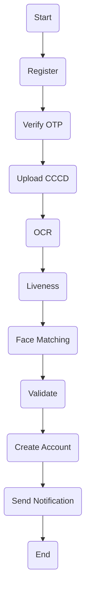
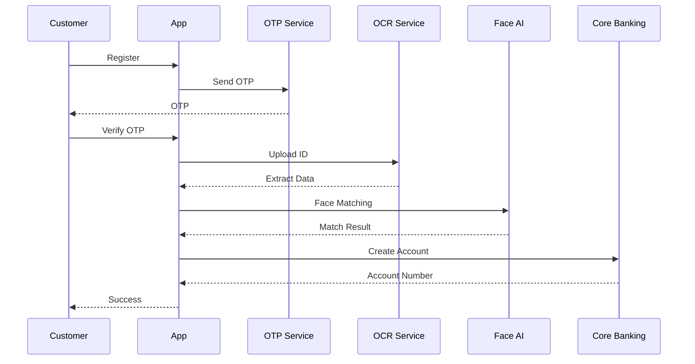

# File 01 - `History_Prompts_SRS.txt`

```text
============================================================
PROJECT
ABC Bank Online Account Opening System (eKYC)
Software Requirements Specification (SRS)
============================================================

Prompt 01

# Role

Đóng vai một Senior Business Analyst kiêm System Analyst có hơn 10 năm kinh nghiệm trong lĩnh vực FinTech và Ngân hàng số.

Nhiệm vụ của bạn là xây dựng tài liệu Software Requirements Specification (SRS) theo chuẩn IEEE cho hệ thống mở tài khoản trực tuyến (eKYC).

Dữ liệu đầu vào được lấy từ tài liệu Business Analysis đã hoàn thành.

============================================================

Prompt 02

Viết Phần 1 - Introduction gồm:

- Purpose
- Scope
- Definitions
- Acronyms
- References
- Overview

Sử dụng văn phong kỹ thuật chuyên nghiệp.

============================================================

Prompt 03

Viết Phần 2 - Overall Description gồm:

- Product Perspective
- Product Functions
- User Classes and Characteristics
- Operating Environment
- Design and Implementation Constraints
- Assumptions and Dependencies

============================================================

Prompt 04

Viết Phần 3 - Specific Functional Requirements.

Chia thành các module:

- Account Registration
- OTP Verification
- Upload ID Card
- OCR Processing
- Face Verification
- Liveness Detection
- Account Creation
- Notification

Mỗi chức năng cần mô tả:

- Requirement ID
- Description
- Input
- Processing
- Output
- Exception

============================================================

Prompt 05

Viết Phần 4 - Non Functional Requirements.

Bao gồm:

Security

Performance

Availability

Reliability

Maintainability

Scalability

Audit Logging

Backup

Disaster Recovery

Compliance

Trình bày dạng bảng.

============================================================

Prompt 06

Sinh Use Case Diagram bằng Mermaid.

Bao gồm các Actor:

- Customer
- OCR Service
- Face Recognition
- Core Banking
- Notification Service

============================================================

Prompt 07

Sinh Activity Diagram bằng Mermaid mô tả quy trình eKYC.

============================================================

Prompt 08

Sinh Sequence Diagram bằng Mermaid cho quy trình mở tài khoản.

============================================================

Prompt 09

Tổng hợp toàn bộ thành tài liệu Software Requirements Specification hoàn chỉnh theo chuẩn IEEE.

Định dạng Markdown.
```

---

# File 02 - `Software_Requirements_Specification.md`

````markdown
# Software Requirements Specification (SRS)

# ABC Bank Online Account Opening System (eKYC)

Version 1.0

---

# Table of Contents

1. Introduction

2. Overall Description

3. Specific Functional Requirements

4. Non Functional Requirements

5. Visual Diagrams

---

# 1. Introduction

## 1.1 Purpose

Tài liệu này mô tả các yêu cầu phần mềm của hệ thống mở tài khoản trực tuyến (eKYC) dành cho ABC Bank. Đây là tài liệu chính thức phục vụ nhóm Development, QA và các bên liên quan trong quá trình phát triển hệ thống.

## 1.2 Scope

Hệ thống cho phép khách hàng mở tài khoản ngân hàng hoàn toàn trực tuyến thông qua quy trình định danh điện tử (eKYC), bao gồm xác thực danh tính bằng CCCD, nhận diện khuôn mặt và cấp số tài khoản tự động mà không cần giao dịch viên can thiệp.

## 1.3 Definitions & Acronyms

| Thuật ngữ | Ý nghĩa |
|-----------|----------|
| eKYC | Electronic Know Your Customer |
| OCR | Optical Character Recognition |
| OTP | One-Time Password |
| Liveness Check | Kiểm tra người thật |
| CIF | Customer Information File |
| API | Application Programming Interface |

## 1.4 References

- IEEE 830 Software Requirements Specification
- Quy định eKYC của Ngân hàng Nhà nước Việt Nam

---

# 2. Overall Description

## 2.1 Product Perspective

Hệ thống là một ứng dụng ngân hàng số tích hợp với các dịch vụ OCR, AI Face Recognition, Core Banking và Notification Service.

## 2.2 Product Functions

- Đăng ký tài khoản
- Xác thực OTP
- Tải ảnh CCCD
- OCR nhận dạng thông tin
- Nhận diện khuôn mặt
- Kiểm tra Liveness
- Cấp số tài khoản
- Gửi thông báo

## 2.3 User Classes and Characteristics

| Người dùng | Đặc điểm |
|-------------|-----------|
| Customer | Khách hàng sử dụng ứng dụng để mở tài khoản |

## 2.4 Constraints

- Tuân thủ quy định eKYC
- Dữ liệu cá nhân phải được mã hóa
- Hệ thống hoạt động trên Android và iOS
- Phụ thuộc vào Core Banking và AI Services

---

# 3. Specific Functional Requirements

## FR-01 Account Registration

**Mô tả:** Khách hàng nhập thông tin cá nhân để bắt đầu đăng ký.

- Input: Họ tên, số điện thoại, email
- Processing: Kiểm tra định dạng dữ liệu
- Output: Hồ sơ đăng ký
- Exception: Dữ liệu không hợp lệ

## FR-02 OTP Verification

**Mô tả:** Xác thực số điện thoại bằng OTP.

- Input: OTP
- Processing: Kiểm tra OTP
- Output: Xác thực thành công
- Exception: OTP sai hoặc hết hạn

## FR-03 Upload ID Card

**Mô tả:** Tải ảnh mặt trước và mặt sau CCCD.

- Input: Hai ảnh CCCD
- Processing: Kiểm tra chất lượng ảnh
- Output: Ảnh hợp lệ
- Exception: Ảnh mờ hoặc thiếu

## FR-04 OCR Processing

**Mô tả:** Trích xuất dữ liệu từ CCCD.

- Input: Ảnh CCCD
- Processing: OCR
- Output: Họ tên, ngày sinh, số CCCD...
- Exception: OCR thất bại

## FR-05 Face Verification

**Mô tả:** So khớp khuôn mặt với ảnh CCCD.

## FR-06 Liveness Detection

**Mô tả:** Kiểm tra người thật.

## FR-07 Account Creation

**Mô tả:** Tạo CIF và cấp số tài khoản.

## FR-08 Notification

**Mô tả:** Gửi SMS và Email thông báo kết quả.

---

# 4. Non Functional Requirements

| Category | Requirement |
|------------|-------------|
| Security | Mã hóa AES-256, HTTPS/TLS 1.3 |
| Authentication | OTP và JWT |
| Performance | API phản hồi dưới 3 giây |
| Availability | 99.9% uptime |
| Reliability | Tự động khôi phục khi lỗi |
| Scalability | Hỗ trợ tối thiểu 10.000 request/phút |
| Logging | Ghi log toàn bộ giao dịch |
| Backup | Sao lưu dữ liệu hàng ngày |
| Disaster Recovery | Khôi phục sau thảm họa dưới 2 giờ |
| Compliance | Tuân thủ quy định eKYC và AML |

---

# 5. Visual Diagrams

## Use Case Diagram (Mermaid)

```mermaid
usecaseDiagram

actor Customer
actor "OCR Service" as OCR
actor "Face AI" as Face
actor "Core Banking" as Core
actor Notification

Customer --> (Register Account)
Customer --> (Upload ID Card)
Customer --> (Verify OTP)
Customer --> (Face Verification)

(Register Account) --> OCR
(Face Verification) --> Face
(Face Verification) --> Core
(Core) --> (Generate Account)
(Generate Account) --> Notification
```

## Activity Diagram (Mermaid)



## Sequence Diagram (Mermaid)


````